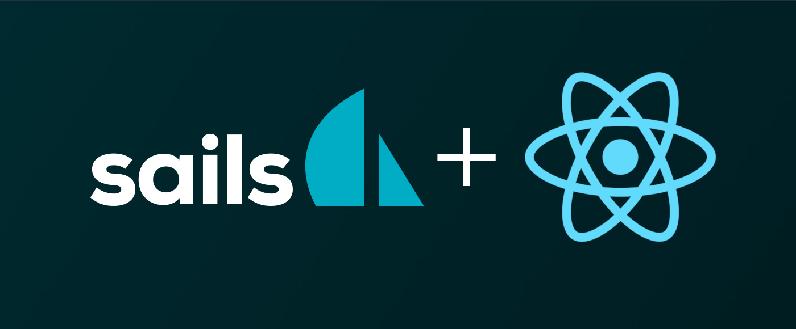

# sails-react-boilerplate



A very simple and lightweight configuration of SailsJS to speed up your
development process.
This boilerplate provides also all the latest front-end technologies such as
ReactJS and Webpack.

Nevertheless, one of the goals of this project is to keep the boilerplate as
simple as possible to allow any developer to customize the boilerplate to fit
their own needs.


## Features

- :white_check_mark: [Sails 1.2](https://sailsjs.com) :boat:
- :white_check_mark: React 16.12.0 :star2:
- :white_check_mark: Webpack 4 :zap:
- :white_check_mark: Hot Module Replacement :fire:


## Usage

Clone and install the dependencies like you'd normally do:

```
git clone git@github.com:NicholasPeretti/sails-react-boilerplate.git my-project
cd my-project
npm install
npm run dev
```

For the best developer experience rename the origin remote in `sails-react-boilerplate`:

```
git remote rename origin sails-react-boilerplate
```

This is very useful when `react` or other dependencies are updated. In that case
this boilerplate will remain updated and you'll be able to fetch the latest version
with the following:

```
git stash
git fetch sails-react-boilerplate
git rebase
git stash pop
```

This should do the job, but be careful.


## :warning: Webpack configuration :warning:

This project comes with a ready-to-use webpack configuration.

There should be more or less everything you need, but it's likely that you'll
want to change the configuration.

You can change it however you want, just remember: **if
you need to change the entrypoint, update the configuration in all
the environments!**


## Philosophy
If you want to use these technologies combo (Sails and React)
you have three options:

* Install sails and customize it until it meets your needs
* Use a mix between Sails and Sails hooks
* Find and use one of the available boilerplates on GitHub

The best thing to do is to create a custom sails configuration to fit all your
needs. The downside is that creating your own perfect environment requires time
and energy. You have to make sure that everything works and, if you work for a web
agency, you probably can't waste that amount of time in configuration.

The real world, often, is not a utopia.
Sometimes you have the chance to work on well planned projects, with clear
requirements, tests, deadlines, roadmaps and whatever.
Other times, the project requirements aren't even written. You have to install
the product in no time and every day you work in rush.
Suddenly the code quality does not matter anymore.

This kind of things contribute to create an unhealthy environment for developers,
that leads to low quality products, full of bugs and almost unusable.
It also means that you'll have to work on it later to fix all the problems that
you have created in the first place.

So, this project is an attempt to create a clean start point, already configured
with the latest technologies to let you focus on the product, not on the
project configuration.

The mission is to create a reusable boilerplate that allows you to deploy your
product faster, **without too much configuration**.

There are a lot of ready to use boilerplates with sails and react out there.
Anyway, I still can't find one that fits my needs.
Sometimes they still use grunt (too slow), or they don't let me use multiples
webpack configurations (dev vs prod).

So this is the boilerplate that fits **my needs**, I hope it will fits yours too.
